# MANUALE UTENTE

### 1. Introduzione al Gioco degli Scacchi
Gli scacchi sono un gioco da tavolo strategico per due giocatori. Considerato uno dei giochi più antichi e più profondi al mondo, gli scacchi combinano abilità, tattica, logica e previsione. Ogni partita si gioca su una scacchiera 8x8 e ha l'obiettivo finale di dare "scacco matto" al re avversario, ovvero metterlo sotto attacco in modo tale che non possa sfuggire.

Il gioco degli scacchi ha origini antichissime che risalgono probabilmente all'India del VI secolo, dove era conosciuto come *chaturanga*. Da lì si diffuse in Persia (come *shatranj*) e successivamente nel mondo islamico e in Europa medievale, subendo varie evoluzioni fino alla forma moderna attuale, stabilizzata tra il XV e il XIX secolo.  
Oggi, gli scacchi sono un gioco riconosciuto a livello globale, praticato sia a livello amatoriale sia professionale, con tornei internazionali e una federazione ufficiale: la FIDE (Fédération Internationale des Échecs).

---

### La Scacchiera

  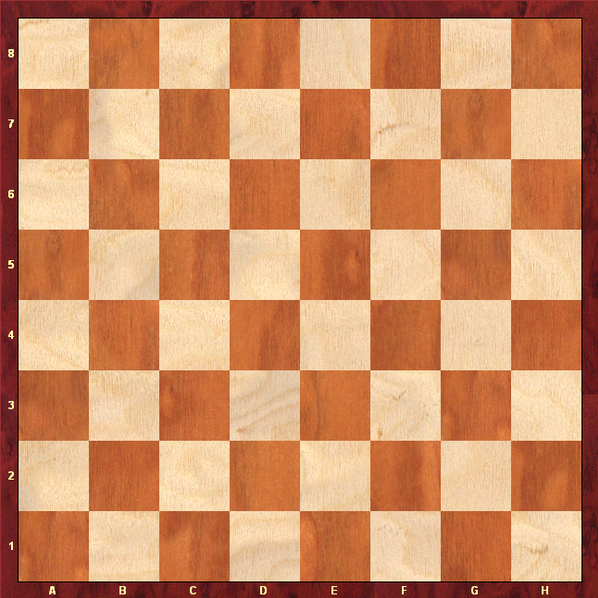

La scacchiera è composta da:

- **8 righe** (numerate da 1 a 8)
- **8 colonne** (indicate con le lettere da a a h)
- In totale **64 caselle** 

Esempio di coordinate: `e4` indica la colonna **e** e la riga **4**.

---

### I Pezzi del Gioco

Ogni giocatore (bianco e nero) inizia con **16 pezzi**, per un totale di **32 pezzi** sulla scacchiera:

- **1 Re**
- **1 Donna (Regina)**
- **2 Alfieri**
- **2 Cavalli**
- **2 Torri**
- **8 Pedoni**

Ogni pezzo ha un tipo di movimento specifico e un valore strategico nel gioco.

---

### Obiettivo del Gioco

L'obiettivo è dare **scacco matto** al re avversario: una condizione in cui il re è sotto attacco e non può effettuare alcuna mossa per mettersi al sicuro.

### Movimento dei Pezzi

- **Re**: si muove di una casella in qualsiasi direzione
- **Donna**: si muove in linea retta in qualsiasi direzione (orizzontale, verticale, diagonale)
- **Torre**: si muove in linea retta solo in orizzontale o verticale
- **Alfiere**: si muove solo in diagonale
- **Cavallo**: si muove a "L" (due caselle in una direzione, poi una perpendicolare) e può saltare sopra altri pezzi
- **Pedone**: si muove in avanti di una casella (due dalla posizione iniziale) e cattura in diagonale

### Notazione Algebrica

Lo standard internazionale per descrivere le mosse nel gioco degli scacchi è la **notazione algebrica**. Essa prevede che la scacchiera sia composta da:

- **8 colonne**, etichettate con le lettere dalla **a** alla **h**
- **8 righe**, numerate dalla **1** alla **8**

  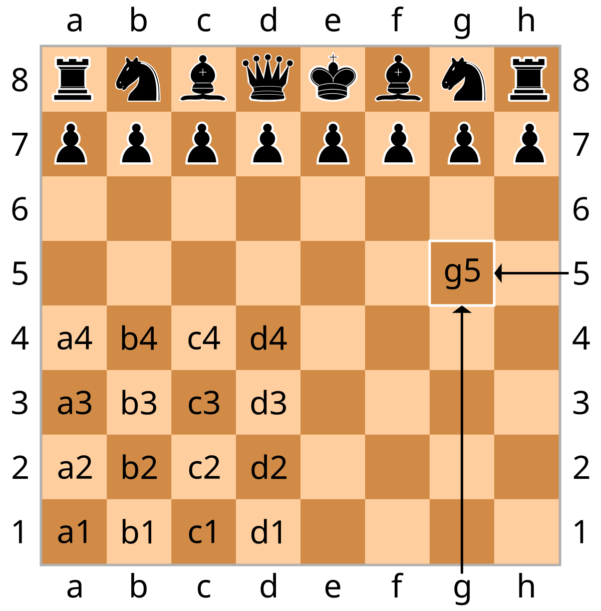

Ogni casella ha un nome univoco: ad esempio, la casella nell’angolo in basso a sinistra è `a1`, mentre quella in alto a destra è `h8`.
Le mosse vengono scritte specificando **la posizione di arrivo** del pezzo:
`e4`

Questo significa che il pezzo si sposta **nella casella e4**.

##### Esempi di mosse

- `e4` → un pedone si muove  per andare in e4
- `Dd4` → un a regina  si muove  per andare in d4
- `Tc1` →  una torre si muove per andare in c1

##### Regole di validità

- Le mosse devono essere **legalmente valide** secondo le regole degli scacchi
- Il formato deve essere sempre caratteri senza separazione (niente spazi o altri caratteri)
- I caratteri devono essere minuscoli e nel formato corretto ([a-h][1-8])
- La mossa deve sempre iniziare con la lettera maiuscola dell'iniziale del pezzo (es. C per cavallo), tranne per il pedone.

| **Pezzo**  | **Iniziale (Notazione Algebrica Italiana)** |
|------------|---------------------------------------------|
| Re         | R                                           |
| Regina     | D                                           |
| Torre      | T                                           |
| Alfiere    | A                                           |
| Cavallo    | C                                           |
| Pedone     | *(nessuna iniziale)*                        |

### 2. Comandi del gioco

All'avvio del gioco viene mostrata una interfaccia ASCII art col menù principale.

  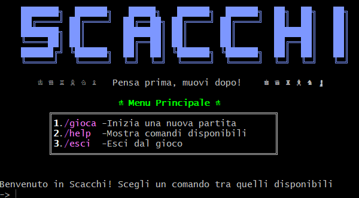

Una volta che l'utente sceglie uno dei comandi visualizzati e preme invio, tale comando verrà eseguito. Se tale comando non fosse valido, verrà mostrato il relativo messaggio d'errore

  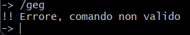

#### I comandi dell'applicazione
Vi sono due tipologie di comandi:
* Comandi iniziali (mostrati nel menu principale): /gioca, /help, /esci
* Comandi in gioco (richiamabili in ogni momento quando si sta giocando): /help, /gioca, /scacchiera, /mosse, /abbandona, /patta, /esci

#### Comando /help
Per visualizzare tutti i 7 comandi disponibili con la loro descrizione, l'utente dovrà digitale il comando "/help" e premere invio.

  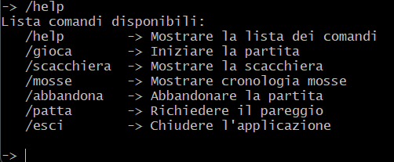

#### Comando /gioca
Per cominciare una nuova partita l'utente deve scrivere il comando "/gioca" e premere invio. L'applicazione chiederà il nome dei 2 giocatori (per primo quello con i pezzi bianchi e quello coi pezzi neri) e una volta inseriti, mostrerà l'utente di cui è il turno.

  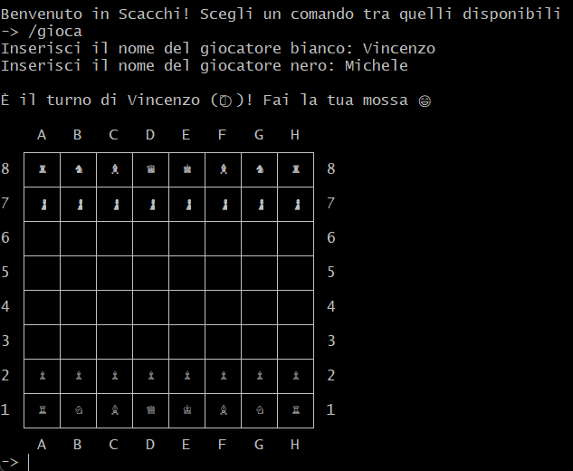

A questo punto l'utente bianco inizierà il gioco con la sua mossa.

#### Comando /scacchiera
Per visualizzare la scacchiera, l'utente potrà immetterà il comando "/scacchiera" e premere invio. Se tale comando viene digitato prima dell'inizio della partita, allora verrà mostrato un messaggio d'errore che indicherà che la partita non è ancora iniziata e inviterà l'utente a inserire comando "/gioca".

  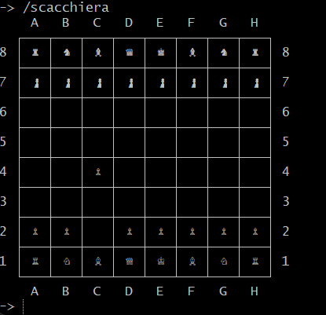

#### Comando /mosse
Per visualizzare tutte le mosse effettuate da entrambi i giocatori, l'utente deve digitare il comando "/mosse" e premere invio. Verrà mostrato l'elenco delle mosse (in notazione algebrica) del giocatore bianco (indicato con un pallino bianco) e del nero (indicato con un pallino nero).

  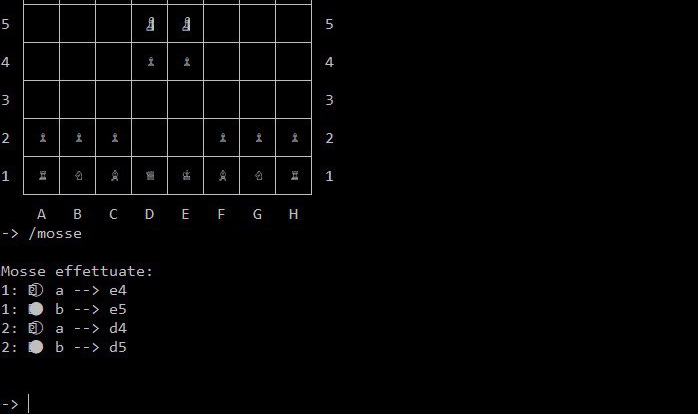

#### Comando /abbandona
Per abbandonare la partita in corso, l'utente deve digitare il comando "/abbandona" e premere invio.  Verrà poi richiesta un'ulteriore conferma a cui l'utente può rispondere:
* 's' confermando di abbandonare la partita facendo così vincere il 2^ giocatore per abbandono
* 'n' rimanendo in partita

Qualora questo comando venisse inserito quando non si è in partita, verrà mostrato un messaggio d'errore.

  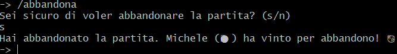

#### Comando /patta
Per chiedere la patta l'utente dovrà inserire il comando "/patta" e premere invio, ma solo qualora avesse già effettuato una mossa. Viene poi stampato un messaggio di accettazione della patta all'altro giocatore e alla risposta positiva ('s') di quest'ultimo viene terminanata la partita in pareggio. Se il comando "/patta" viene invocato quando non si è in gioco, viene stampato un relativo messaggio d'errore.

  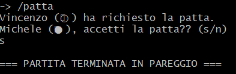

#### Comando /esci
Al fine di chiudere l'applicazione (sia in gioco che non), l'utente dovrà digitare il comando "/esci" e verrà chiesta conferma a cui l'utente potrà rispondere:
* "s" se vuole confermare la chiusura del gioco
* "n" se vuole annullare l'uscita e ritornare all'applicazione potendo inserire un comando o una mossa (se in gioco)

  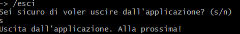

  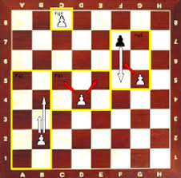

  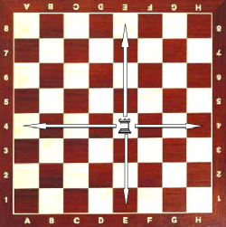

  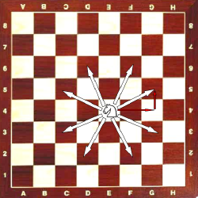

  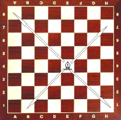

  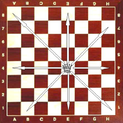

  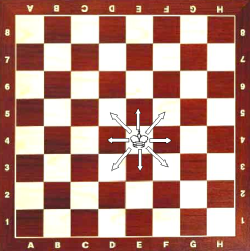

  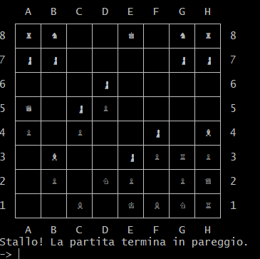

  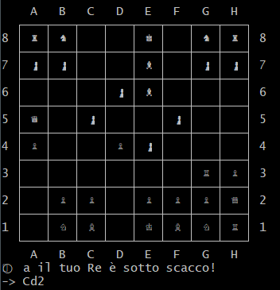

  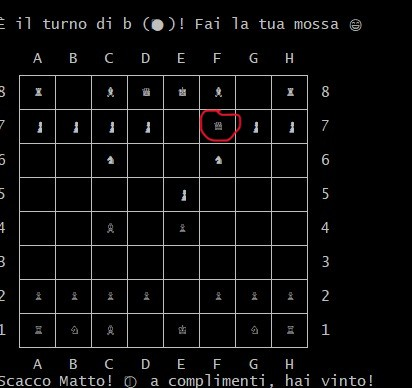
</p

