# REPORT TECNICO – SCACCHI CODD

## 1. INTRODUZIONE

*Scacchi Codd* è un'applicazione a linea di comando sviluppata dal team *Codd* nell’ambito del corso universitario di *Ingegneria del Software*. Il progetto ha come obiettivo la realizzazione di un simulatore di scacchi per due giocatori umani, eseguibile da terminale e conforme alle regole ufficiali del gioco. L’applicazione è progettata per l’esecuzione locale su un singolo dispositivo.

Le mosse vengono inserite tramite comandi testuali utilizzando la notazione algebrica standard (es. `e4`, `Cf3`, `0-0`), il sistema ufficialmente riconosciuto dalla FIDE per la rappresentazione delle partite.

Lo sviluppo si è svolto interamente in **Python 3.11.9**, seguendo le pratiche del framework **Scrum**. Il lavoro è stato suddiviso in Sprint pianificati, ciascuno con obiettivi specifici. Tutti i membri del team hanno contribuito come sviluppatori, mentre i ruoli di *Scrum Master* e *Product Owner* sono stati ricoperti dal docente del corso. Le attività sono state organizzate sia in modalità asincrona (tramite GitHub e gestione delle issue), sia in modalità sincrona (pair programming e incontri online).

Durante lo Sprint 0, il team ha dimostrato familiarità con Git, GitHub Flow e il processo Scrum, organizzando l’ambiente di lavoro e definendo il backlog iniziale. Lo Sprint 1 ha avuto come obiettivo la realizzazione di un MVP funzionante che includesse la gestione completa dei pedoni nella fase di apertura della partita.

Sono stati utilizzati strumenti professionali: **GitHub** per il versionamento, **Docker** per la containerizzazione, **Ruff** per il linting e **GitHub Actions** per la CI.

---

## 2. MODELLO DI DOMINIO

Il dominio del progetto *Scacchi Codd* è centrato sulla simulazione di una partita a scacchi classica tra due giocatori umani, secondo le regole ufficiali del gioco. Gli elementi principali del modello sono rappresentati da classi e strutture dati che riflettono la struttura concettuale del gioco: pezzi, scacchiera, partita, giocatori e gestione del turno.

La **scacchiera** è modellata come una matrice 8x8, dove la cornice esterna è utilizzata per visualizzare lettere e numeri, mentre l’area centrale contiene i pezzi. Ogni casella può contenere un riferimento a un oggetto `Pezzo` oppure essere vuota. La visualizzazione è gestita da una classe dedicata.

I **pezzi** sono rappresentati da una gerarchia di classi: una superclasse astratta `Pezzo`, da cui derivano le sottoclassi concrete (`Re`, `Donna`, `Torre`, `Alfiere`, `Cavallo`, `Pedone`).

La classe `Gioco` inizializza la scacchiera, crea i due `Giocatore`, imposta il turno iniziale (bianco) e gestisce lo stato della partita. Il turno è gestito dalla classe `GestoreTurni`, che alterna i giocatori.

Ogni **giocatore** è un’istanza della classe `Giocatore`, che contiene almeno il nome e il colore.  
La validazione delle mosse sarà centralizzata e supportata da un gestore delle eccezioni.

  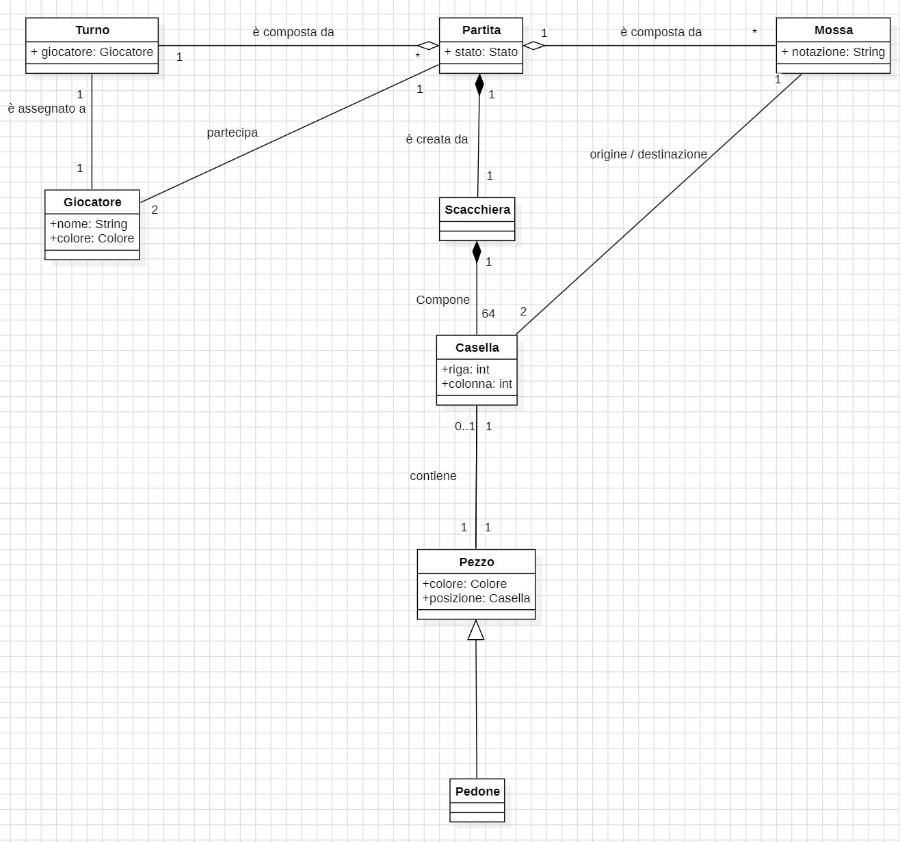

---

## 3. REQUISITI SPECIFICI

### 3.1 REQUISITI FUNZIONALI

#### RF1 – Comando help

*Come giocatore voglio mostrare l'help con elenco comandi*

**Criteri di accettazione**:
- Al comando `/help` o flag `--help` o `-h`, l’app mostra una descrizione e l’elenco comandi.

#### RF2 – Inizio nuova partita

*Come giocatore voglio iniziare una nuova partita*

**Criteri di accettazione**:
- Al comando `/gioca`, se nessuna partita è in corso, la scacchiera viene mostrata con i pezzi in posizione iniziale e il bianco inizia.

#### RF3 – Visualizzazione scacchiera

*Come giocatore voglio mostrare la scacchiera con i pezzi*

**Criteri di accettazione**:
- Al comando `/scacchiera`:
  - Se la partita non è iniziata, suggerisce `/gioca`;
  - Altrimenti mostra la scacchiera corrente.

#### RF4 – Abbandono della partita

*Come giocatore voglio abbandonare la partita*

**Criteri di accettazione**:
- Al comando `/abbandona`, l’app chiede conferma:
  - Se sì, l’avversario vince;
  - Se no, si torna in attesa di input.

#### RF5 – Proposta di patta

*Come giocatore voglio proporre la patta*

**Criteri di accettazione**:
- Al comando `/patta`, l’avversario riceve una richiesta:
  - Se accetta, la partita termina in pareggio;
  - Se rifiuta, il gioco prosegue.

#### RF6 – Chiusura del gioco

*Come giocatore voglio chiudere il gioco*

**Criteri di accettazione**:
- Al comando `/esci`, l’app chiede conferma:
  - Se confermato, termina l’esecuzione;
  - Altrimenti, continua.

#### RF7 – Movimento del pedone

*Come giocatore voglio muovere un pedone*

**Criteri di accettazione**:
- Accetta mosse in notazione algebrica (`e4`, `d5`);
- Le mosse devono rispettare le regole:
  - Avanzamento di una o due case (alla prima mossa);
  - No avanzamento su pezzo;
- Se la mossa è valida, la scacchiera viene aggiornata; altrimenti viene mostrato un errore.

#### RF8 – Visualizzazione mosse giocate

*Come giocatore voglio mostrare le mosse giocate*

**Criteri di accettazione**:
- Al comando `/mosse`, l’app mostra la lista delle mosse effettuate, in notazione algebrica numerata:
e4 c6
d4 d5

---

### 3.2 REQUISITI NON FUNZIONALI

#### RNF1 – Container Docker 
L’applicazione **deve essere eseguita all’interno di un container Docker**.
#### RNF2 – Terminali supportati
I terminali supportati sono:
<h4>Terminal (Linux)</h4>
 
<h4>Terminal (macOS)</h4>
 
<h4>PowerShell (Windows)</h4>
 
<h4>Git Bash (Windows)</h4>
 

- I pezzi devono essere rappresentati in Unicode UTF-8:
♔ ♕ ♖ ♗ ♘ ♙ ♚ ♛ ♜ ♝ ♞ ♟
- La codifica del terminale deve essere **UTF-8**.
- Riferimento: [Simboli scacchistici – Wikipedia](https://it.wikipedia.org/wiki/Scacchi#Descrizione_e_regolamento)

> **Nota:** Su terminali con sfondo scuro, i colori dei pezzi potrebbero risultare invertiti.  
> In particolare, su Git Bash per Windows, i caratteri speciali come le emoji non vengono visualizzati correttamente.  
> Per una esperienza ottimale, si consiglia l’utilizzo di un terminale con sfondo chiaro.

---

## 4. SYSTEM DESIGN

## 4.1 Diagramma dei package

Il progetto è stato organizzato in package in modo da separare logicamente le entità di dominio.  
Nello specifico, il package `scacchi` contiene le classi centrali per l'esecuzione della partita (`Gioco`, `Scacchiera`, `GestoreTurni`, `Comandi`, `Applicazione`, ecc.), mentre il package `pezzi` contiene tutte le classi che rappresentano i singoli pezzi del gioco (`Re`, `Torre`, `Pedone`, `Cavallo`, ecc.).

  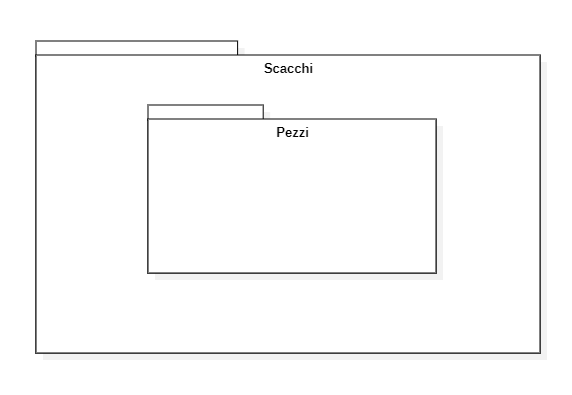

### 4.2 Commento sulle decisioni prese con riferimento ai requisiti non funzionali e ai principi di progettazione

Il progetto del nostro gruppo segue i principi fondamentali della programmazione orientata agli oggetti, dimostrando una buona padronanza dei concetti di astrazione, incapsulamento, ereditarietà e polimorfismo; per ognuno di questi riportiamo una breve descrizione e relativo screenshot della loro applicazione concreta all’interno del progetto

#### Astrazione e Modularità

L'uso della classe astratta Pezzo è un esempio molto chiaro di come si possa applicare il concetto di astrazione. Questa classe rappresenta un modello generale per i vari tipi di pezzi degli scacchi, definendo un’interfaccia comune (come simbolo(), mosseValide(), mossaValida()). Poi, ogni pezzo concreto (come Pedone, Torre, Cavallo, Alfiere, Regina, Re) implementa e personalizza questi metodi secondo le proprie regole di movimento. Questa struttura aiuta a mantenere le responsabilità ben divise, rendendo il sistema più facile da gestire e da espandere

#### Esempio classe pezzo

#### Esempio classe cavallo

#### Ereditarietà

Per quanto riguarda l’ereditarietà, questa viene applicata con la classe base Pezzo, che fornisce metodi condivisi, mentre le sottoclassi specifiche, come Cavallo e Alfiere, sovrascrivono le funzioni per adattarle ai loro comportamenti particolari. Ad esempio, Cavallo e Alfiere hanno metodi diversi per il movimento, sfruttando comunque la struttura comune fornita dalla classe Pezzo

> **Nota:** Si omettono gli screenshot per evitare l'utilizzo di immagini già utilizzate. 

#### Polimorfismo

Il polimorfismo si vede chiaramente nel modo in cui vengono implementati i metodi mosseValide() e mossaValida(): anche se sono definiti nella classe Pezzo, vengono poi specificati nelle sottoclassi per adattarsi ai diversi pezzi. Questo permette di usare tutti i pezzi in modo uniforme, tramite un’interfaccia comune, e facilitare l’integrazione nel gioco, ad esempio nella classe Scacchiera.

> **Nota:** Si omettono gli screenshot per evitare l'utilizzo di immagini già utilizzate. 

#### Incapsulamento

Le classi sono progettate con un forte incapsulamento, cioè tengono sotto controllo i dati interni e limitano l’accesso ai metodi. Per esempio, ogni pezzo gestisce la propria logica per determinare le mosse valide, evitando che dettagli interni vengano modificati per sbaglio.

> **Nota:** Si omettono gli screenshot per evitare l'utilizzo di immagini già utilizzate. 

#### Composizione

Un altro aspetto importante è la composizione: il modo in cui Gioco, Giocatore, Scacchiera e GestoreTurni si relazionano tra loro. Ogni elemento ha una funzione ben precisa. Per esempio, il Gioco raccoglie Scacchiera e GestoreTurni, e si affida a loro per gestire lo stato della scacchiera e il cambio di turno dei giocatori. Questa organizzazione rende il sistema più modulare e facile da aggiornare o ampliare

### 4.3 Architettura Entity-Control-Boundary (ECB)

L'architettura Entity-Control-Boundary (ECB) è stata adottata anche nel nostro progetto per organizzare meglio le responsabilità delle diverse classi:

- **Entity**
Le classi che rappresentano i pezzi degli scacchi (come Pezzo e le sue sottoclassi) sono le entità del dominio. Queste si occupano di tutto ciò che riguarda lo stato interno e le regole di movimento di ogni pezzo. Hanno metodi utili per verificare se una mossa è valida o meno.

- **Control**
Le classi Applicazione e Parser sono i cosiddetti controller, che si occupano di coordinare tutto l'interazione tra le entità e il resto del sistema. L'Applicazione gestisce il ciclo di gioco e i comandi che arrivano dall'utente, mentre il Parser interpreta le mosse in notazione algebrica e le traduce in azioni sulla scacchiera.

- **Boundary**
Il modulo Scacchiera funziona come un boundary, perché si occupa di mostrare il gioco, sia graficamente che testualmente, ed è il punto di contatto tra il sistema e l'utente. Anche i comandi che ricevi nel terminale (GitBash, PowerShell, etc.) sono un modo attraverso il quale il boundary interagisce con il mondo esterno.

### 4.4 Stile Architetturale

Lo stile architetturale che, abbiamo deciso di adottare è quello Layered per una serie di vantaggi ed osservazioni. Il primo pensiero che abbiamo fatto, come unità di gruppo quando stavamo decidendo quale stile architetturale adottare, è stato il concetto di modularità del progetto, il quale è subito saltato all’occhio in quanto la totalità del progetto può essere suddivisa in chiari livelli che interagiscono tra di loro, essi sono:

- **Interfaccia**: gestita dalla classe Applicazione, si occupa dell’interazione con l’utente.
- **Controllo**: gestito da Comandi e Parser, è responsabile dell’interpretazione e gestione dei comandi.
- **Dominio**: rappresentato dalle classi Gioco, Scacchiera, GestoreTurni, Pezzo e le sue sottoclassi, che implementano la logica del gioco degli scacchi.
- **Utility**: se ne occupa la classe GestoreEccezioni e, come intuibile dal nome, gestisce gli errori

#### Esempio stile layered

 
 
La classe applicazione non implementa direttamente la logica per interpretare la mossa o gestire il turno, invece delega alle classi Parser e Gioco(gestoreTurni) l’interpretazione della mossa e il turno del giocatore. 
Facendo così ogni livello nasconde i propri dettagli interni ed espone solo ciò che serve agli altri livelli.

La stratificazione lasca è stata una scelta obbligata in quanto era doveroso, permettere ai livelli superiori di invocare direttamente a più livelli inferiori, facendo così si facilità anche l’implementazione.

---

## 5. OO DESIGN

Nella modellazione delle classi abbiamo mantenuto una costante attenzione alla separazione delle responsabilità tra logica di dominio, gestione del gioco e interazione con l’utente. Due aspetti significativi emersi durante la progettazione sono stati l’introduzione della classe `Gioco` come coordinatore centrale e la scelta di rendere la `Scacchiera` un oggetto autonomo ma accessibile solo tramite i metodi previsti.

**Classe Gioco**: rappresenta il cuore del sistema. Si occupa di inizializzare la partita, creare i giocatori, gestire il turno attivo e orchestrare tutte le interazioni tra i pezzi e la scacchiera.  
È anche responsabile della validazione delle mosse e della gestione dello stato della partita.

Questa struttura consente di centralizzare le regole e le condizioni di gioco, mantenendo le classi dei pezzi focalizzate solo sui rispettivi comportamenti individuali.

**Comunicazione tra componenti**: la classe `Comandi`, che gestisce l’input da terminale, comunica direttamente con `Gioco`, che a sua volta si occupa di invocare i metodi sulla `Scacchiera`, aggiornare lo stato e restituire una rappresentazione pronta per essere stampata.

Questa separazione consente una maggiore gestione del codice: l’interfaccia a riga di comando potrebbe in futuro essere sostituita o estesa senza modificare la logica centrale.

### 5.1 Diagrammi user story

---

#### **Help**
Questa user story rappresenta il comando `/help`, che mostra una l’elenco completo dei comandi disponibili. Non coinvolge la logica di gioco, ma interagisce solo con la parte di presentazione.

  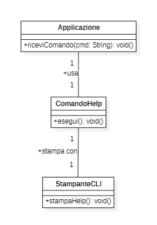

  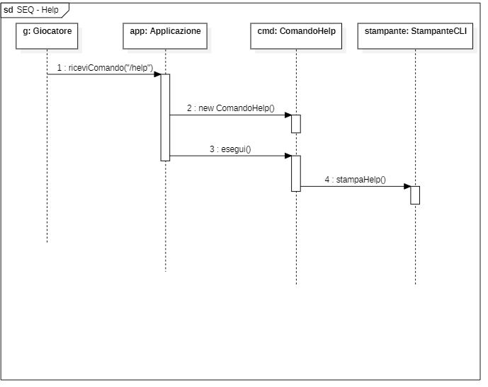

---

#### **Gioca**
Il comando `/gioca` inizializza una nuova partita, posizionando i pezzi nella configurazione iniziale e assegnando il primo turno al bianco. La scacchiera viene stampata a video.

  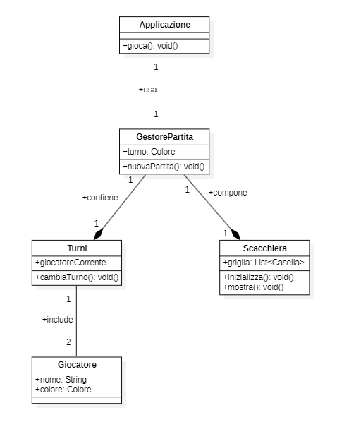

  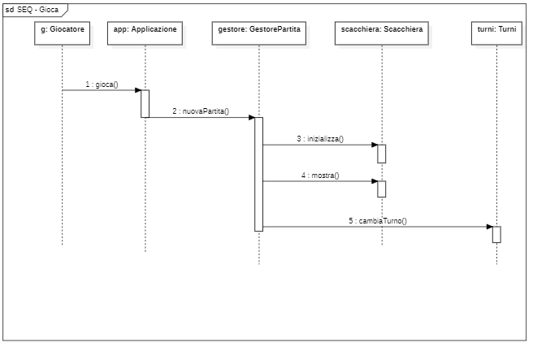

---

#### **Muovi**
Questa funzionalità gestisce l'inserimento di una mossa da parte dell’utente in notazione algebrica. Verifica la validità, aggiorna la scacchiera e cambia il turno.

  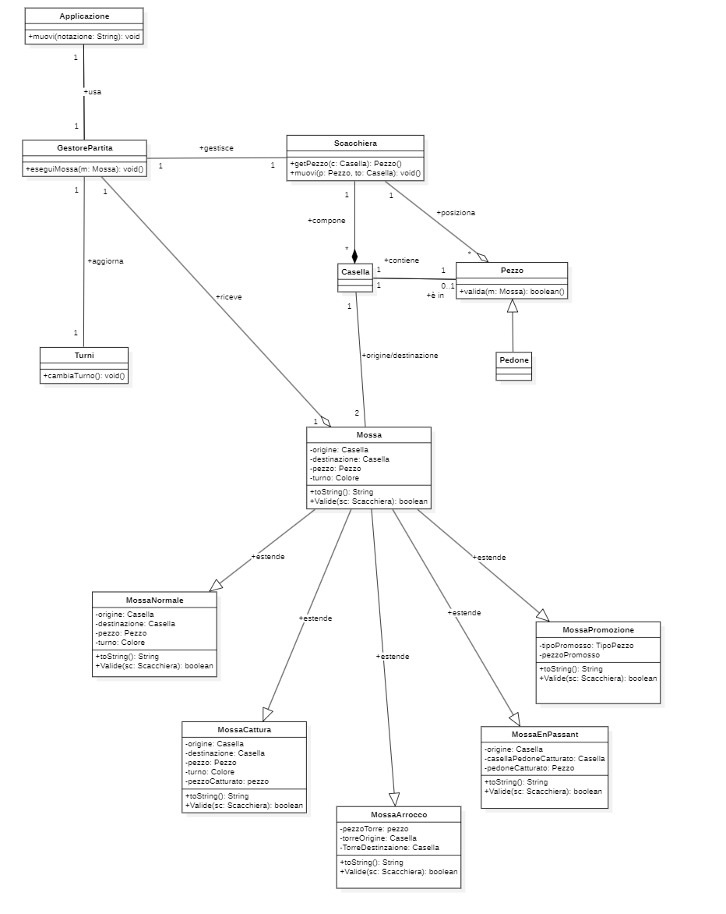

  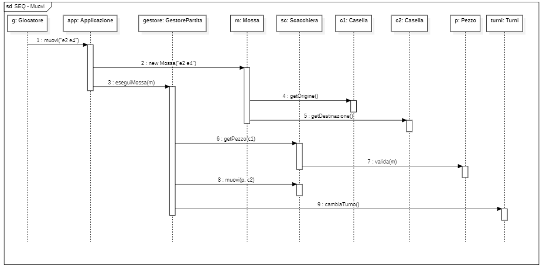

---

#### **Mosse**
Il comando `/mosse` restituisce la lista delle mosse giocate fino a quel momento in notazione algebrica numerata.

  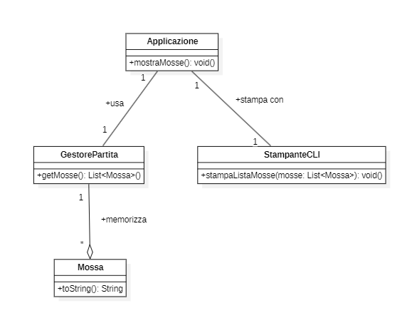

  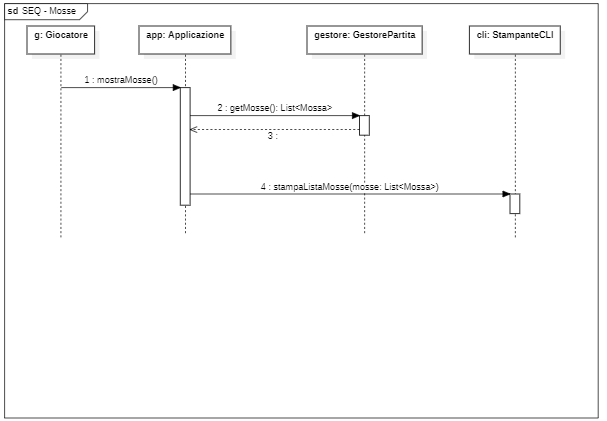

---

#### **Patta**
Il comando `/patta` permette a un giocatore di proporre il pareggio. L’altro giocatore può accettare o rifiutare.

  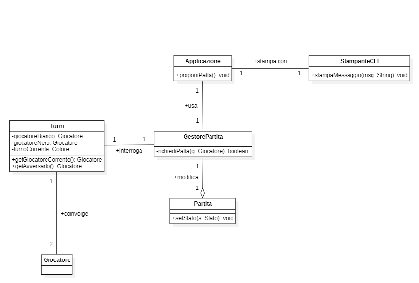

\

  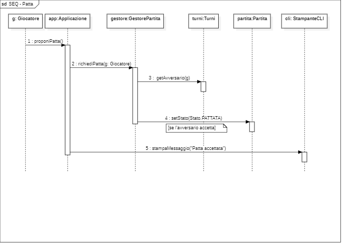

---

#### **Abbandona**
Il comando `/abbandona` consente a un giocatore di rinunciare alla partita. Richiede conferma e assegna la vittoria all’avversario.

  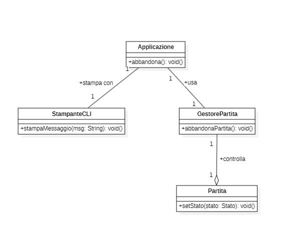

  

---

#### **Esci**
Il comando `/esci` termina l'applicazione. Come altri comandi critici, richiede conferma all’utente.

  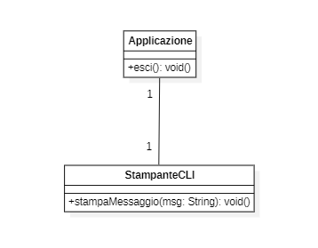

  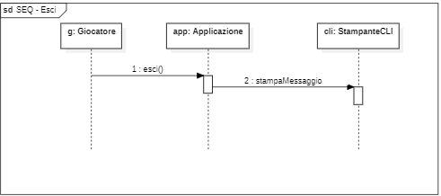

## 5.2 Principi OO adottati

Una delle priorità prefissate dai membri del gruppo è stata l’adozione dei principi di progettazione visti durante il corso

- **Single Responsibility Principle**: ogni classe ha un compito preciso, come si vede tra Gioco, Giocatore, Scacchiera e GestoreTurni. 

- **Separazione tra Logica di Presentazione e Logica di Dominio**: 
questa distinzione rende il codice più semplice da capire e da mantenere nel tempo. Per esempio, la logica di dominio, che comprende le regole dei movimenti e la gestione delle regole del gioco, è affidata alle classi Pezzo, Parser e alla stessa Scacchiera. Questi moduli si concentrano sulle funzionalità di base, senza preoccuparsi di come vengono mostrati all’utente. Invece, la presentazione viene gestita dal modulo Scacchiera, che si occupa di stampare la scacchiera in formato testuale. Così, si può modificare o migliorare il modo in cui il gioco viene mostrato senza toccare le regole di base.

- **Basso accoppiamento e alta coesione**:
ogni modulo funziona in modo abbastanza indipendente dagli altri. Per esempio, il Parser non conosce i dettagli di come si disegna la scacchiera, e viceversa. Questo rende più semplice mantenere e testare tutto. 

- **Incapsulamento e astrazione**:
ogni classe protegge i propri dati, esponendo solo i metodi necessari. Per esempio, la logica del movimento è gestita dai pezzi stessi, mentre la verifica della validità della mossa viene delegata ad altri componenti

- **Principi SOLID** 

  Ci siamo concentrati anche per fare in modo che il codice avesse una buona comprensione dei principi SOLID:

  - Single Responsibility Principle (SRP): Ogni classe nel progetto ha una sola responsabilità ben definita, come mostrato nella separazione tra Gioco, Giocatore, Scacchiera e GestoreTurni.

  - Open/Closed Principle (OCP): Le classi sono progettate per essere aperte all'estensione ma chiuse alla modifica. Ad esempio, l'uso di ereditarietà e astrazione consente di aggiungere facilmente nuovi pezzi senza modificare il codice esistente.

  - Liskov Substitution Principle (LSP): Le sottoclassi possono essere sostituite con le loro superclassi senza alterare la correttezza del programma.

  - Interface Segregation Principle (ISP): Sebbene non siano presenti interfacce esplicite, l'uso della classe astratta Pezzo fornisce un'interfaccia essenziale che non obbliga le sottoclassi a implementare metodi non pertinenti.

  - Dependency Inversion Principle (DIP): L'alto livello di astrazione nella progettazione (Pezzo, Scacchiera) consente alle classi di dipendere da astrazioni e non da implementazioni concrete.

## 5.3 Design Pattern

Per quanto concerne l’utilizzo dei vari design pattern, noi membri del gruppo abbiamo studiato a fondo l’applicabilità di questi e discusso, durante la fase di progettazione, di quali, tra quelli visti durante il corso, fossero più convenienti da implementare al fine di facilitare l’organizzazione e la realizzazione del progetto.

Nonostante avessimo deciso insieme una strada da intraprendere è doveroso notificare che durante la creazione delle varie classi è stato necessario ridiscutere le decisioni prese a causa degli inconvenienti riscontrati durante l’effettiva realizzazione del progetto, tutto sempre nel rispetto delle regole stabilite nel code of conduct.

Passando dunque agli effettivi design pattern utilizzati, essi sono i seguenti:

 
 

### - Pattern: Strategy

Questo pattern Definisce una famiglia di algoritmi, li incapsula in classi o funzioni separate e li rende intercambiabili a runtime. 

All’interno della classe “Parser”, all’interno del metodo “trova_funzioni” è incapsulata una strategia di ricerca per ogni pezzo della scacchiera. Grazie a questo il Parser seleziona dinamicamente la strategia in base al tipo di pezzo

 
 

### - Pattern: Factory Method 

Definisce un’interfaccia per creare oggetti, ma permette alle sottoclassi di decidere quale classe concreta istanziare.
In altre parole, sposta la logica di creazione degli oggetti fuori dalla classe principale, rendendo il codice più flessibile e aperto all’estensione.
Tale pattern è stato molto utile per la generazione della scacchiera, nello specifico quella riguardante i pezzi della scacchiera in quanto sottoclassi.

Il metodo generaPezzo riceve un tipo di pezzo (es. 'T', 'C', 'D') e un colore ('bianco' o 'nero') e decide dinamicamente quale classe concreta istanziare (Torre, Cavallo, Regina) restituendo un oggetto che implementa l’interfaccia del Pezzo.

 
 

### - Pattern: Singleton

Il Singleton è un design pattern creazionale che garantisce che una classe abbia una sola istanza e fornisce un punto di accesso globale a quell’istanza.

Inizialmente non era stato pensato di adottare questo design per la gestione degli errori, tuttavia dopo che diversi membri hanno sollevato la questione inseguito ad un attenta consultazione siamo giunti alla conclusione che sarebbe stato più comodo utilizzare come singleton il metodo di gestione delle eccezioni. 

Di esempi nel codice ce ne sono molteplici, questi sono solo rappresentativi:

 

 
 

### - Pattern: Facade 

L’interfaccia è stata probabilmente la scelta più semplice e condivisa per tutti. La classe applicazione, infatti, è colei che funge da interfaccia per tutto il programma, andando a nascondere tutte le complessità delle classi utilizzate

 
 

### - Pattern: Interpreter

Un’altra scelta altrettanto ovvia è stata la scelta del design pattern intepreter in quanto necessaria per lo sviluppo del parser. 

Esempi lampanti sono i due metodi “riconosciMossa” e “convertiNotazione”:

 

 
 

### - Pattern: Template Method

Il Template Method è un design pattern comportamentale che definisce la struttura di un algoritmo in una classe base (astratta o concreta) e delega alle sottoclassi l’implementazione di alcuni passaggi specifici.

Anche questa era una scelta piuttosto scontata per la classe pezzo e le sue varie sottoclassi, infatti i suoi metodi come “simbolo” e “mosseValide” sono definite volontariamente in maniera predefinita in quanto devono essere sovrascritti dalle sottoclassi ognuno in maniera differente

 

### - Pattern: Command

Questo tipo di pattern design incapsulare la richiesta in un oggetto che accoda, registra le richieste e supporta l’undo

Piuttosto scontata è stata anche la scelta di utilizzare questo design per il metodo che avrebbe gestito l’interazione dei comandi con l’utente:

 
 

---

## 6. RIEPILOGO DEL TEST

Il progetto è stato testato utilizzando il framework **Pytest**, con test automatici eseguiti tramite script Python.  
Tutti i test sono contenuti nella cartella `tests/`, e sono suddivisi per file in base alla classe testata.

  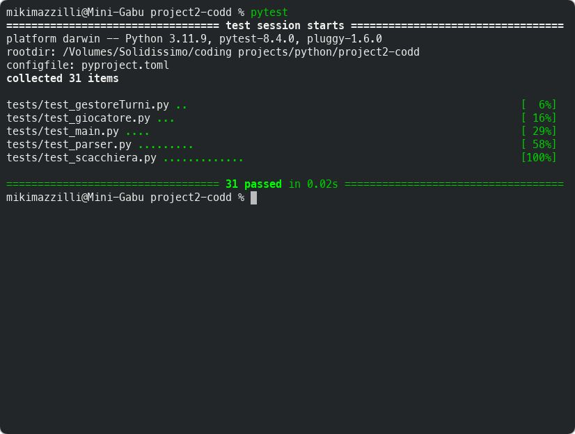

### Struttura dei test

- `test_gestoreTurni.py`: verifica la logica di cambio turno tra giocatori.
- `test_giocatore.py`: controlla la corretta creazione e gestione dei dati relativi ai giocatori.
- `test_main.py`: testa i flussi principali dell'applicazione e i comandi utente.
- `test_parser.py`: verifica l’interpretazione e il parsing dei comandi da linea di comando.
- `test_scacchiera.py`: testa il comportamento della scacchiera, inclusa l’inizializzazione e la disposizione dei pezzi.

### Criteri di selezione

Abbiamo deciso di concentrare i test su:

- I **metodi che elaborano input dell’utente**, in quanto soggetti a errori di sintassi, formattazione o flusso.
- I metodi con **logica condizionale o comportamenti variabili**, che potenzialmente possono portare a stati inattesi o errori.
- Le **classi centrali del gioco**, per assicurare la coerenza tra l’interazione utente e lo stato della partita.

L’esecuzione ha prodotto un totale di **31 test**, tutti superati correttamente.

---
## 7 - Processo di sviluppo e organizzazione del lavoro

Il gruppo Codd durante la durata di tutti gli sprint si è impegnato a rispettare tutti i principi dello sviluppo Agile e i principi di Scrum come precedentemente ribadito nel code of conduct. 

Fondamentale è stato sicuramente il principio di etica intrinseco in ogni membro della gruppo, grazie ad esso, infatti, siamo riusciti a migliorare la comunicazione e a lavorare in maniera più coesa andando a sopraffare le difficoltà incontrate durante il percorso; tuttavia l’etica non è stato il solo fattore che ci ha aiutato. 
A tal proposito le difficoltà incontrate sono nate soprattutto nello sprint 1. Esse hanno riguardato i metodi di organizzazione e gestione del carico di lavoro da svolgere. Grazie però ad un attenta sprint retrospective dello sprint 1 ed un meticoloso sprint planning dello sprint 2, il gruppo è riuscito a conseguire tutti gli obiettivi prefissati in un tempo ragionevole. 

Per quanto concerne i punti di forza del gruppo è doveroso evidenziare come l’armonia e la collaborazione l’abbiano fatta da padrona. Nello specifico sono emersi, durante gli sprint, punti di forza e debolezza per ogni membro del gruppo, ma grazie alla comunicazione trasparente delle proprie difficoltà, all’aiuto reciproco dei membri più portati in alcuni campi e ad una buona dose di perseveranza le debolezze di ognuno sono state colmate per quanto possibile. 

Infine, per l’intero gruppo la parola d’ordine era “comunicazione”. Nel rispetto delle regole istituite nel code of conduct tutti i membri del team hanno sempre partecipato alle riunioni, anche se lunghe e ogni membro del team è stato totalmente disponibile nel rivedere il proprio operato e discuterne con gli altri finché non è stato trovato un accordo comune. 

Riguardo ciò è stato di vitale importanza l’utilizzo della piattaforma di comunicazione digitale, nota col nome di Discord, che ha permesso a tutti i membri una semplice condivisione del lavoro svolto e ha ridotto drasticamente i tempi di consultazione di esso da parte degli altri membri; grazie ad essa è stato anche più semplice gestire i daily-scrum e gli incontri extra dovuti a difficoltà e problemi inaspettati.

***Tools per l'organizzazione***: Trello e Discord.

***Tools per lo sviluppo***: VisualStudio Code (per la scrittura del codice e file markdown) e StarUML (per la creazione di diagrammi).

---

## 8. ANALISI RETROSPETTIVA

Nel corso dello sviluppo del progetto, al termine di ciascuno Sprint è stata condotta una retrospettiva interna al team con l’obiettivo di riflettere sull’efficacia delle attività svolte, analizzare criticità emerse e individuare azioni di miglioramento continuo.  
La seguente sezione riassume l’organizzazione del lavoro in termini di flusso operativo e collaborazione, utilizzando emoji come strumento sintetico per rappresentare il carico percepito e la natura delle attività.

La board è stata strutturata secondo il flusso:  
`To do → In progress → Review → Ready → Done`

**Legenda emoji**:
- 😄 Attività svolta con facilità e soddisfazione  
- 😐 Attività neutra o senza particolari difficoltà  
- 😓 Attività faticosa o impegnativa  
- 👥 Attività svolta in collaborazione 

### 8.1 SPRINT 0 – RETROSPETTIVA

Lo Sprint 0 è stato dedicato all’organizzazione iniziale del progetto e alla configurazione dell’infrastruttura tecnica e metodologica. Il team *Codd* ha completato tutte le attività previste, gettando le basi per uno sviluppo agile efficace.

#### Lavagna Sprint 0
  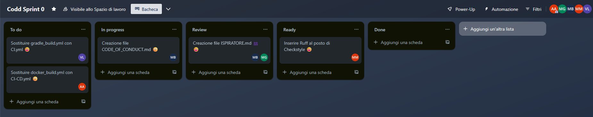

#### Punti di forza

- Configurazione GitHub completa: branch protetti, workflow CI/CD, assegnazione automatica delle issue.
- Ogni membro ha contribuito con almeno un commit, gestito issue e PR con review.
- Sono stati redatti i file:
- `README.md`
- `CODE_OF_CONDUCT.md`
- `ISPIRATORE.md`

#### Azioni correttive

- Migliorare la pianificazione individuale all’inizio dello Sprint.
- Mantenere aggiornata quotidianamente la board Trello.
- Introdurre una breve riunione settimanale per assegnare le issue.
- Prevedere un momento di sincronizzazione settimanale per evitare sovrapposizioni.
- Fare una revisione finale di gruppo (README, Report, Board).

#### Conclusione

Lo Sprint 0 ha permesso al team di acquisire familiarità con l’infrastruttura, GitHub Flow, board Scrum e strumenti CI/CD. Le difficoltà iniziali sono state superate con successo, preparando un terreno stabile per gli Sprint successivi.

---
### 8.2 SPRINT 1 – RETROSPETTIVA

Lo Sprint 1 aveva come obiettivo principale la realizzazione di un MVP completo per il gioco degli scacchi, concentrandosi in particolare sulla gestione dei **pedoni**, l’**inizializzazione della partita**, e la **visualizzazione interattiva della scacchiera**. Oltre all’implementazione delle funzionalità principali, sono stati completati task legati a refactoring, gestione errori, e documentazione.

####  Lavagna Sprint 1

  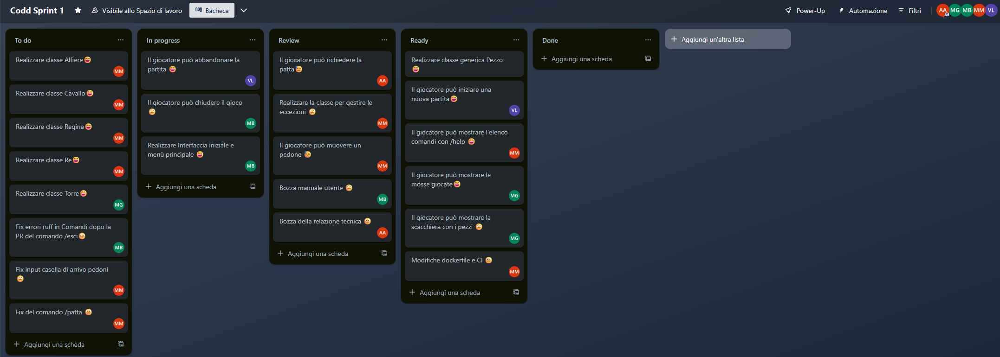

---

####  Attività completate

- Tutte le user story funzionali da #01 a #08 sono state completate.
- Realizzate tutte le basi per le classi dei pezzi (`Pedone`, `Re`, `Regina`, `Alfiere`, `Cavallo`, `Torre`, `Pezzo`).
- Gestita la richiesta di patta, abbandono, chiusura e visualizzazione delle mosse.
- Integrazione continua configurata (CI/CD). 
- Redatta la bozza della relazione tecnica e del manuale utente.

---

#### Azioni correttive

-  Migliorare la gestione delle review: alcune PR sono arrivate tardi in review e hanno rallentato il flusso.
-  Aggiornare la board più frequentemente, soprattutto nei passaggi tra "In Progress" e "Review", per riflettere lo stato reale del lavoro.
-  Condividere i blocchi o rallentamenti su Discord (o Whatsapp), anche fuori dal daily.
-  Rafforzare i momenti di sincronizzazione del team, soprattutto tra review e merge.

---

####  Considerazioni finali

Lo Sprint 1 si è concluso con un’applicazione funzionante, testata e documentata nelle sue funzionalità fondamentali.  
La gestione del lavoro tramite Trello e GitHub si è rivelata efficace, ma perfezionabile sul piano della pianificazione e delle review.  